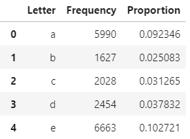
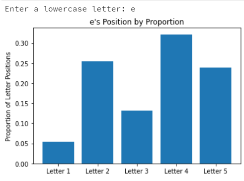

# Wordle Optimization Project

***Our "robo guesser" can solve any Wordle puzzle in an average of 4.53 guesses.*** This automatic guesser along with other functions that provide useful analytics for players who want to improve their guesses without cheating are included in this project.

## How to Use Key Functions
All functions in this repository will provide basic information with use of help(*function()*), but below is how to use the key functions.
### Prerequisites
You will need Python as well as packages **pandas** and **matplotlib** to use the functions in this project.
### Loading the Possible Words Set
It's important that you load a set of possible words to use all other functions in this repository. We recommend you use the `wordleWords.txt` file which includes all accepted words by Wordle. Simply put the file path for your chosen word set into `create_set()` to return a possible word set.
```
 possible_set = create_set('wordleWords.txt')
```
### Letter Frequency and Placement Distributions
These functions are great for players who want to learn how to improve their guesses. First, `letter_prop_df()` returns a pandas DataFrame that displays the frequency and proportion of each letter in the given possible word set.
```
letter_prop_df(possible_set)
```
Example Output:



Second, `single_let_dist_viz()` asks for a single lowercase letter input and shows a distribution of where that letter can be found in each of the 5 possible positions in the given possible word set
```
single_let_dist_viz(possible_set)
```
Example Output:



### Robo Guessers
Last, but not least, is the "robo guessers". Both of our robo guessers use optimal guesses found by finding the expected value of green letters as a result of a guess and penalizing words with double letters by subrating 0.5 from that expected value. The difference between our `manual_robo_guesser()` and `auto_robo_guesser()` is that the manual guesser promts you to input the result of each guess while the automatic guesser takes the answer and plays the game out automatically. For example, the manual guesser can be used to play Wordle when you don't know the answer already where the automatic guesser can be used to see how fast our algorithm solved today's puzzle.
```
manual_robo_guesser(possible_set)

auto_robo_guesser(possible_set, answer)
```

## Authors
Created by Dalton and Colin Chenoweth
